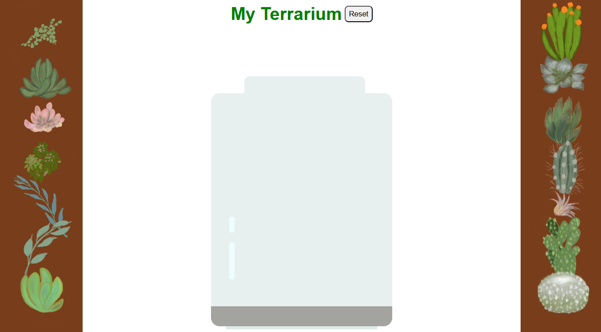

# 🌿 My Terrarium
My Terrarium is a simple interactive web application where users can create and customize their own virtual terrarium.
This project was built to showcase front-end development skills in HTML, CSS, and JavaScript.

## 🚀 Getting Started
### Run locally
1. Clone the repository:
```bash
git clone https://github.com/potatopotati/My-Terrarium.git
```
2. Navigate into the project directory:
```bash
cd My-Terrarium
```

## 🛠️ Built With
1. HTML
2. CSS
3. Javascript
